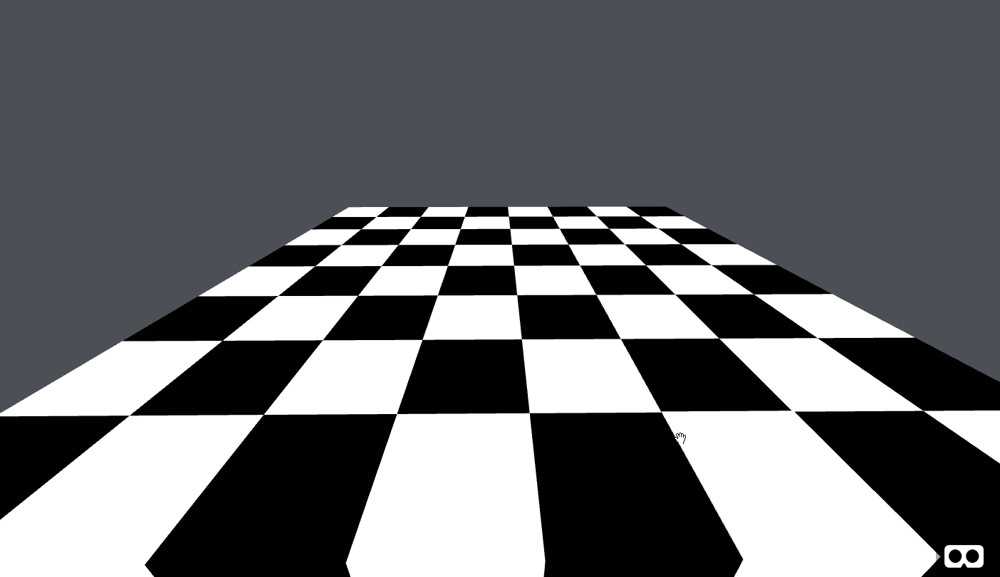

# Part 1 - Setting up the scene - the board

## Layout

To start with a simple and comprehensive first milestone, the scene is only made of the board and a flat color sky. We'll see later on if I can add an environment.

To make positionning easy, I create a basic plane that will serve as the "boardContainer". All other entities will be children of this plane, so that their positions will be expressed relatively and not absolutely. More informations on [aframe docs](https://aframe.io/docs/master/introduction/entity-component-system.html "entity-component-system"). Then we'll be free to move the board around the scene, flip it, scale it... The only drawback is that the plane is rotated along the x-axis, and so will the children entites. No matter, we'll just rotate them back.
The boardContainer has a component named ... board ! I will define all the initialization logic inside. Later, I will probably add some physics constraints on it too.

## Tiles

We could have a simple image texture to render the board tiles, but that wouldn't help much when it comes to placing and moving the pieces. Instead, I create 8x8 pizza boxes to embody the tiles.
Each tile is created from a blend of two ["mixins"](https://aframe.io/docs/master/core/mixins.html "mixins") that gives us: 
* "white"/"black": the material (just a basic color for now)
* "tile": the geometry (pizza box) and basic event handlers for mouse enter/mouse leave

Instead of placing the tiles one after the other, I'm adding them at initialization time of the board component.
For each column/row pair, I create an entity based on the blend we saw earlier. The material is conveniently defined by its position: if row and column indexes are both even or odd, then the tile is white. Else, it's black. Also, the position is very easily defined from row and column indexes, because each tile is based on a 1x1 square.

```javascript
    let color = (rowIndex % 2 === colIndex % 2 ? "white" : "black");
    let el = document.createElement("a-entity");
    el.id = col + row;
    el.setAttribute("mixin", color + " tile");
    el.setAttribute("tile", "name:" + el.id + ";color:" + color);
    el.setAttribute("position", (colIndex + 1) + " " + (rowIndex + 1) + " 0");
    self.el.appendChild(el);
```

As I wrote earlier, the entity is appended to "self", which is the boardContainer.

[Checkout the code for this first part on github](https://github.com/macmorning/aframe-chess/tree/aa987803d37936dec85293ef112590ac6017a5b1).


## What's next

[In part 2](https://github.com/macmorning/aframe-chess/blob/master/docs/doc-part2.md), I create some basic objects with magicavoxel to use as pieces, and place them on the tiles.