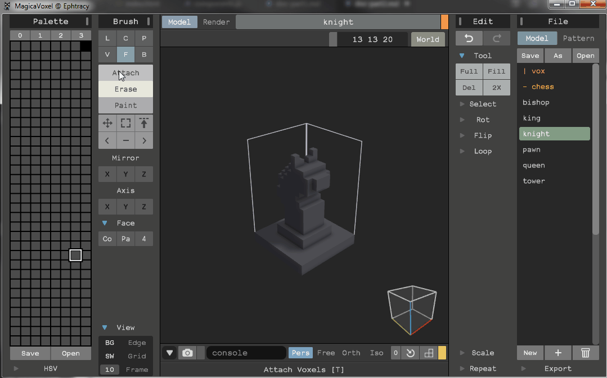
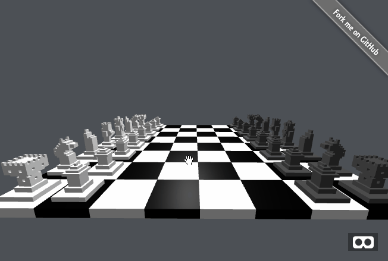
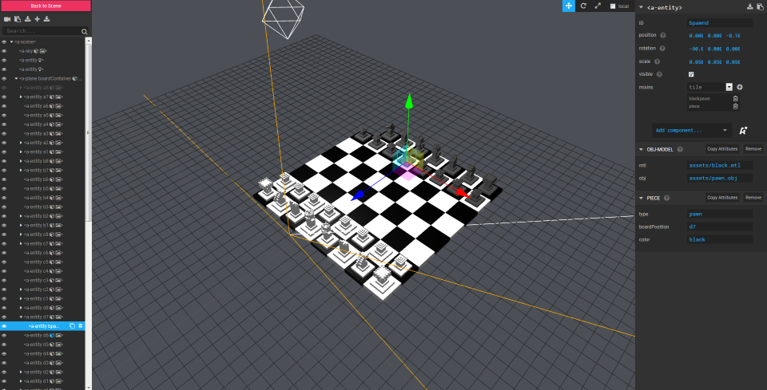
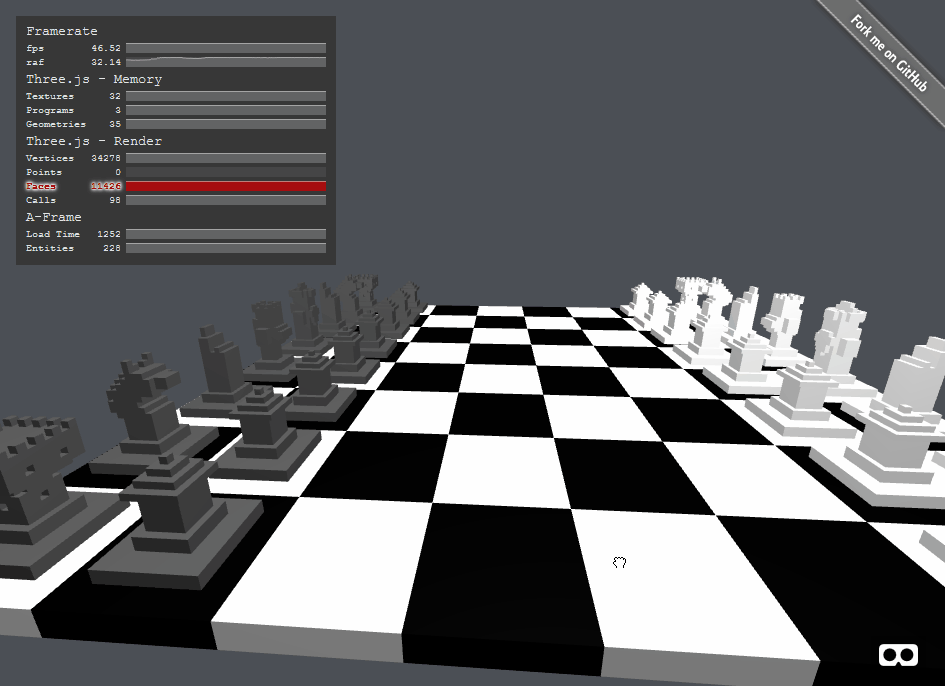

# Part 2 - Creating the pieces and spawning them on the board

## Creating the objects with Magicavoxel

[Magicavoxel](https://ephtracy.github.io/) is a fantastic free tool to build your models. It doesn't come along with hours of pratice and imagination though, so I hope you will forgive me for these terrible 3D pixel puddings that I'll use. :)
That was easier and faster than I thought so, I hope I'll have some time to work again on these models.

Anyway, Magicavoxel lets you create your objects then export them in various formats.
For more informations about the formats, checkout this A-Frame doc by Kevin about "[Building with Magicavoxel](https://github.com/aframevr/aframe/blob/master/docs/guides/building-with-magicavoxel.md)".



I chose to export my objects in the obj format along with a mtl (material) file. A mtl file contains a reference to a palette png file:

```
# MagicaVoxel @ Ephtracy

newmtl palette
illum 1
Ka 0.000 0.000 0.000
Kd 1.000 1.000 1.000
Ks 0.000 0.000 0.000
map_Kd black.png
```

Now I only need 6 object files (pawn, tower, knight, bishop, king, queen), 2 material files (black, white), and 2 png files (black, white).
Object and material files are referenced in the assets, and mixins are made of one object and one material:

```xml
    <a-asset-item id="pawnObj" src="assets/pawn.obj"></a-asset-item>
    <a-asset-item id="knightObj" src="assets/knight.obj"></a-asset-item>
    <a-asset-item id="towerObj" src="assets/tower.obj"></a-asset-item>
    <a-asset-item id="bishopObj" src="assets/bishop.obj"></a-asset-item>
    <a-asset-item id="kingObj" src="assets/king.obj"></a-asset-item>
    <a-asset-item id="queenObj" src="assets/queen.obj"></a-asset-item>
    <a-asset-item id="whiteMtl" src="assets/white.mtl"></a-asset-item>
    <a-asset-item id="blackMtl" src="assets/black.mtl"></a-asset-item>
    <a-mixin id="blackpawn" obj-model="obj: #pawnObj; mtl: #blackMtl"></a-mixin>
    <a-mixin id="blackknight" obj-model="obj: #knightObj; mtl: #blackMtl"></a-mixin>
    <a-mixin id="blacktower" obj-model="obj: #towerObj; mtl: #blackMtl"></a-mixin>
    <a-mixin id="blackbishop" obj-model="obj: #bishopObj; mtl: #blackMtl"></a-mixin>
    <a-mixin id="blackking" obj-model="obj: #kingObj; mtl: #blackMtl"></a-mixin>
    <a-mixin id="blackqueen" obj-model="obj: #queenObj; mtl: #blackMtl"></a-mixin>
    <a-mixin id="whitepawn" obj-model="obj: #pawnObj; mtl: #whiteMtl"></a-mixin>
    <a-mixin id="whiteknight" obj-model="obj: #knightObj; mtl: #whiteMtl"></a-mixin>
    <a-mixin id="whitetower" obj-model="obj: #towerObj; mtl: #whiteMtl"></a-mixin>
    <a-mixin id="whitebishop" obj-model="obj: #bishopObj; mtl: #whiteMtl"></a-mixin>
    <a-mixin id="whiteking" obj-model="obj: #kingObj; mtl: #whiteMtl"></a-mixin>
    <a-mixin id="whitequeen" obj-model="obj: #queenObj; mtl: #whiteMtl"></a-mixin>
```

## Spawning the entities and placing them on the board

Now this part is rather easy. For each initial rows (1, 2, 7 and 8), we have to:
* Create the element based on the right mixin, and the "piece" component
* Rotate it appropriately
* "Append" the element it to the tile

Remember that each tile is an entity? This is very comfortable to place each piece because you can append an entity to another just like you would do in standard DOM. The position of a piece, relative to its parent tile, will always be "0 0 -0.1".

[Checkout the code for this part on github](https://github.com/macmorning/aframe-chess/tree/7fd25482f65a576923a6309032c251e2a03b14a9).



## Using the A-Frame inspector

The recent versions of A-Frame include a very handy inspector. Quite useful to understand where and why that lost entity is gone, fine tune the position and rotation, your lights, ...
To access the inspector, use the ctrl+alt+i keys combo.



## Animating the pieces

This part was a little harder for me to wrap my head around. Actually, I'm still not sure the way I did it was the right way. I'd love some feedback about it if you can.
My first thought was that I would have many animations to create. For each piece:
* picking up
* dropping down
* floating or such once the piece is up in the air
* -will come later- moving from one tile to another

--That's 4 * 32 = 128 more entities. Is this a concern I should have? Is there a better way, using only the standard aframe animation component? That's probably another point I'll have to look again.-- The answer was: switch to [aframe-animation-component](https://www.npmjs.com/package/aframe-animation-component). The current animation component is thought to be deprecated is a future release, replaced by this component. It defines animations as attributes of the entities rather than new entites.

```javascript
// picked up animation
let from = position.x + " " + position.y + " " + position.z;
let to = position.x + " " + position.y + " " + this.data.upPosition;
let animationPickedup = "property: position; startEvents: pickedup; dir: alternate; dur: 500;easing: easeInSine; from:" + from + "; to:" + to;
this.el.setAttribute("animation__pickedup", animationPickedup);

// floating animation
let floatfrom = position.x + " " + position.y + " " + this.data.upPosition;
let floatto = position.x + " " + position.y + " " + (this.data.upPosition + 0.1);
let animationFloating = "property: position; startEvents: pickedup; pauseEvents: dropped; dir: alternate; delay: 500;dur: 1000;easing: easeInSine; loop: true; from:" + floatfrom + "; to:" + floatto;
this.el.setAttribute("animation__floating", animationFloating);

// dropped animation
let animationDropped = "property: position; startEvents: dropped; dir: alternate; dur: 500;easing: easeInSine; from:" + to + "; to:" + from;
this.el.setAttribute("animation__dropped", animationDropped);
```

Now I just have to emit the "pickedup" and "dropped" events to the clicked piece.

[Checkout the code for this part on github](https://github.com/macmorning/aframe-chess/tree/3bb954d7183cc5fff6cf5f7fb99940bf945eeb1d).
[Or click here for the old animation component code](https://github.com/macmorning/aframe-chess/tree/92e04c1c24242d2bbf8e579865e183fd92c7511e).



## What's next

[In part 3](https://github.com/macmorning/aframe-chess/blob/master/docs/doc-part3.md), I -hopefully- implement piece movements.